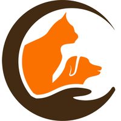

# Projeto APA - ONG APA Telêmaco Borba

Este repositório contém o código-fonte e a documentação do projeto de extensão para a ONG APA Telêmaco Borba, desenvolvido por alunos de Análise e Desenvolvimento de Sistemas do IFPR – Telêmaco Borba.

## 🐾 Sobre o Projeto

O objetivo principal é desenvolver um **Progressive Web App (PWA)** que facilite a gestão de adoções, doações e voluntariado, promovendo a transparência das ações da ONG.

### Objetivos Principais
- **Adoção Responsável**: Divulgação de cães com informações detalhadas e formulários de interesse.
- **Doações Facilitadas**: Espaço dedicado para informações de PIX e lista de itens prioritários.
- **Gestão de Voluntariado**: Captação de interessados em voluntariado e lar temporário.
- **Transparência**: Painel de resultados mensais e histórias de sucesso.

## 📁 Estrutura do Repositório

- **[apa-pwa/](file:///c:/Users/Eri/Documents/GitHub/ProjetoAPA/apa-pwa)**: Código-fonte do Progressive Web App (React + Vite + TypeScript).
- **[Docs/](file:///c:/Users/Eri/Documents/GitHub/ProjetoAPA/Docs)**: Documentação completa do projeto, incluindo requisitos, modelagem de dados e arquitetura.

## 🛠 Tecnologias Utilizadas

- **Front-end**: React 19, Vite, TypeScript, Tailwind CSS, Lucide React.
- **Back-end (BaaS)**: Firebase (Auth, Firestore, Storage, Hosting).
- **Gestão de Estado**: React Query, Context API.
- **Formulários**: React Hook Form, Zod.

---
Desenvolvido em 2025 como parte do Trabalho de Extensão do curso de ADS - IFPR.
